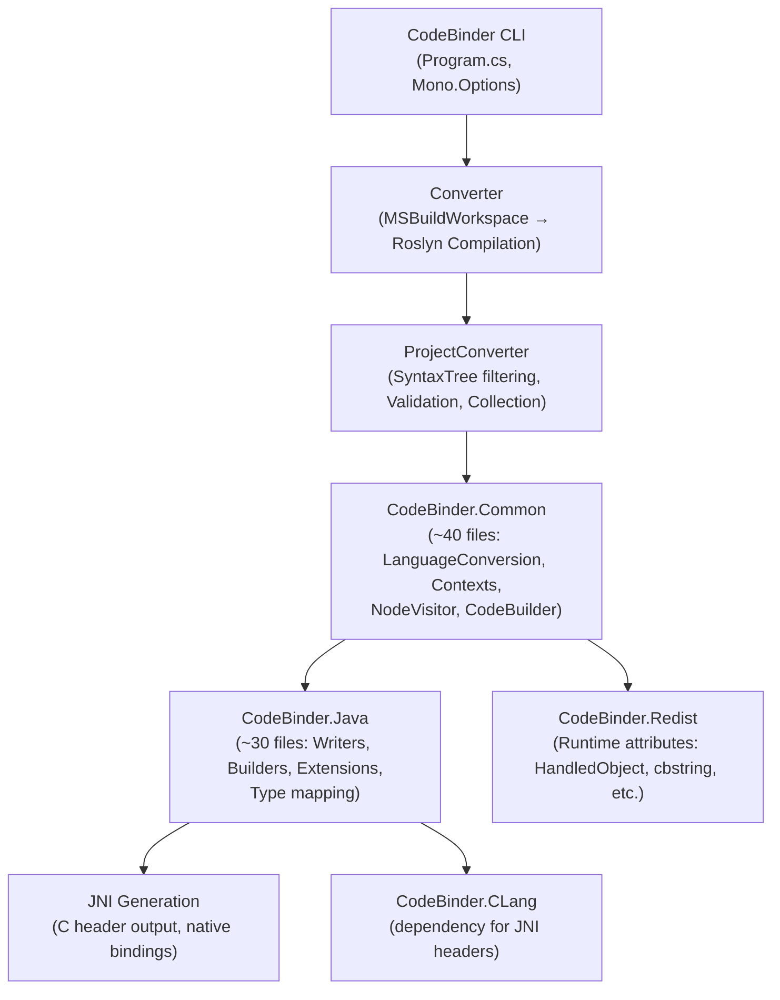

# CodeBinder Review: Architecture, Limitations & Maven Migration Feasibility

## Project Overview

CodeBinder is a C# transpiler that converts C# projects into several target languages (Java, ObjectiveC, TypeScript, C/C++). It was forked from [ICSharpCode.CodeConverter](https://github.com/icsharpcode/CodeConverter) and has been significantly reworked around a plugin-based architecture driven by **Roslyn** (Microsoft.CodeAnalysis).

### Architecture

### Key Pipeline Flow

1. **CLI** parses args, locates the `.csproj`/`.sln`, selects target language
2. **Converter** creates an `MSBuildWorkspace`, opens the project, gets a Roslyn `Compilation`
3. **ProjectConverter** filters syntax trees, runs validation (symbol replacements), then collects type contexts
4. **LanguageConversion** (e.g. `ConversionCSharpToJava`) yields `TypeConversion` objects per class/interface/struct/enum
5. **Writers** (e.g. `JavaClassWriter`, `JavaMethodWriter`) walk Roslyn `SyntaxNode` trees and emit Java source using `CodeBuilder`
6. Output files are written to disk in Java package directory structure

---

## Current Limitations

### Language Feature Gaps (Blocking for Game Logic)

| Feature | Status | Impact on Unity Game Logic |
|---|---|---|
| **Enums** | Partially implemented (integer mapping for JNI, no full Java enum) | ⚠️ High — Unity game state often uses enums heavily |
| **Delegates / Events** | Unsupported | 🔴 Critical — Unity uses `Action<>`, `Func<>`, `event` pervasively |
| **Lambdas / Closures** | Unsupported | 🔴 Critical — modern C# game code relies on lambdas |
| **Interpolated strings** | Unsupported | ⚠️ Medium |
| **Pattern matching (`is`)** | Unsupported | ⚠️ Medium |
| **`default` expression** | Unsupported | ⚠️ Medium |
| **`async`/`await`** | Unsupported | Likely N/A for game state logic |
| **Null-conditional (`?.`)** | Unsupported | ⚠️ Medium — common in C# 6+ code |
| **Null-coalescing (`??`)** | Unsupported | ⚠️ Medium |
| **String interpolation** | Unsupported | ⚠️ Medium |
| **Generic constraints for enums** | `throw new Exception("TODO")` | ⚠️ Medium |
| **Nullable enums** | `throw new Exception("TODO")` | ⚠️ Medium |
| **Local functions** | Unsupported | Low-Medium |
| **`yield return`** | Unsupported | Low |
| **Implicit array creation** | Unsupported | Low |

### Architectural Limitations

1. **JNI-centric design**: The Java conversion is deeply oriented around JNI native interop (handle management, `DllImport`, native method binding). For pure game logic transpilation, all the JNI/native machinery is unnecessary overhead.

2. **No standalone C# parsing**: The pipeline requires `MSBuildWorkspace` which needs a valid `.csproj` with resolvable references. This means you can't just point it at a directory of `.cs` files — it needs a compilable .NET project.

3. **Limited type mapping**: The known-type mapping ([JavaExtensions_Types.cs](file:///c:/Users/Dave/git/CodeBinder/CodeBinder.Java/Java/Extensions/JavaExtensions_Types.cs)) covers BCL primitives and a few collections but is missing many common types used in game logic (e.g. `Dictionary`, `HashSet`, `Queue`, `Stack`, `StringBuilder`, `Math`, `TimeSpan`).

4. **Property → getter/setter**: Properties are mechanically translated to `getX()`/`setX()` methods, which is correct but loses the "record-like" feel. No support for C# records.

5. **No Unity-specific handling**: No awareness of Unity types (`Vector3`, `Quaternion`, `MonoBehaviour`, etc.) — these would need custom type mappings.

6. **Unsigned types silently truncated**: `uint` → `int`, `ulong` → `long` with no overflow checking.

---

## Feasibility: Extracting Java Portion into a Maven/Java Project

### The Core Challenge

> **The entire CodeBinder pipeline is deeply and inextricably coupled to Roslyn (Microsoft.CodeAnalysis).**

Every file in the Java conversion code operates directly on Roslyn types:
- `SyntaxNode`, `SyntaxKind`, `TypeSyntax`, `ExpressionSyntax`, etc.
- `ITypeSymbol`, `IMethodSymbol`, `IFieldSymbol`, `IParameterSymbol`
- `Compilation`, `SemanticModel`
- `SyntaxTree`, `CSharpParseOptions`

This is not a loose dependency — Roslyn types are the fundamental data model passed through every method in the expression builders, statement builders, type mappers, and writers. There are **hundreds** of direct references to `Microsoft.CodeAnalysis` types across the ~60 files that make up the Common + Java libraries.

### Can You Port This to Java?

**Short answer: Not by extraction — but you could rebuild it in Java using a Java-based C# parser.**

#### Option A: "Port" the C# CodeBinder to Java (Hard, High Risk)

You would need to:
1. Find a Java-based C# parser (none are mature — the closest is ANTLR with a C# grammar)
2. Rewrite the entire `CodeBinder.Common` infrastructure (~40 files) to use the new AST types
3. Rewrite all the Java builders/writers/extensions (~30 files) to use the new AST types
4. Lose Roslyn's semantic model (symbol resolution, type inference, overload resolution) — which CodeBinder relies on heavily

**Estimated effort**: 3-6 months for a single developer, high risk of subtle bugs from losing semantic analysis.

#### Option B: Wrap CodeBinder as a CLI and Call from Maven (Recommended Path)

Instead of porting, keep the C# CodeBinder and invoke it from Maven:

1. **Package CodeBinder as a self-contained .NET tool** (it already supports `dotnet tool` packaging)
2. **Create a Maven plugin** that:
   - Checks for `dotnet` runtime availability
   - Invokes `CodeBinder --project=X --language=Java --targetpath=Y --nsmapping=...`
   - Configures source/namespace mappings via `pom.xml` plugin configuration
3. **Add the generated Java sources** to the Maven compilation source roots

This approach:
- ✅ Reuses all existing CodeBinder logic without rewriting
- ✅ Can be done in 1-2 weeks
- ✅ Leverages Roslyn's full semantic analysis
- ❌ Requires .NET SDK on the build machine
- ❌ Still has all the language feature limitations listed above

#### Option C: Java Tool Using Roslyn via .NET Interop (Medium Effort)

Use the existing C# CodeBinder as a library, but expose it as a server or native executable:

1. Build CodeBinder as a **NativeAOT** or **gRPC server** in C#
2. Create a thin Java/Maven client that sends source files and receives Java output
3. Package the native binary alongside the Maven plugin

**Estimated effort**: 2-4 weeks, but more complex deployment.

---

## Recommendation for Unity Game State → Java

For your specific goal (translating Unity game state logic to server-side Java), I would recommend:

1. **Option B (Maven plugin wrapping CodeBinder CLI)** as the quickest path to a working solution
2. **Extend CodeBinder's type mappings** to cover common Unity game state types and C# features you use (enums, lambdas, delegates at minimum)
3. **Create a "game-state" C# project** that contains only the shared logic (no Unity MonoBehaviour, no rendering) with a `.csproj` that references stubs/interfaces for any Unity types

> [!IMPORTANT]
> Before committing to any approach, you should evaluate which C# features your game state logic actually uses. If your game code is heavy on lambdas, delegates, and modern C# patterns, CodeBinder in its current form will require significant extension work regardless of the wrapping approach.

### Next Steps

If you'd like to proceed, I can:
1. **Create the Maven plugin project** (Option B) with proper `pom.xml` configuration for invoking CodeBinder
2. **Extend CodeBinder's Java conversion** to support specific C# features your game logic needs
3. **Set up a test pipeline** with sample Unity game state C# code → Java output
